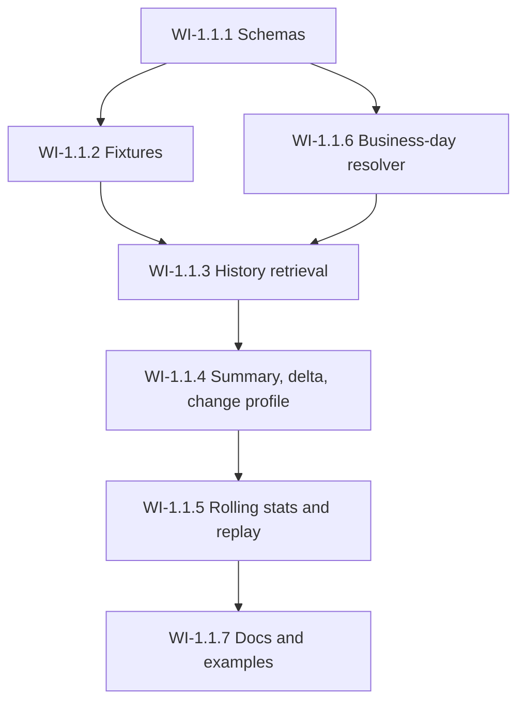

# Risk Analytics Work Item Map

## Purpose

This document gathers the first-module work items into a single implementation map with sequence, dependency logic, and intended output.

## Canonical sequence

### WI-1.1.1

Schemas and enums

Deliverables:

- `MeasureType`
- `HierarchyScope`
- `NodeLevel`
- `SummaryStatus`
- `VolatilityRegime`
- `VolatilityChangeFlag`
- `NodeRef`
- `RiskHistoryPoint`
- `RiskHistorySeries`
- `RiskDelta`
- `RiskSummary`
- `RiskChangeProfile`

### WI-1.1.2

Deterministic fixture pack

Deliverables:

- synthetic hierarchy
- at least two legal entities
- repeated logical nodes across scopes
- zero-prior case
- missing-compare case
- degraded snapshot case
- volatility-sensitive scenarios

### WI-1.1.6

Business-day resolver

Deliverables:

- prior business-day resolution
- pinned calendar behavior
- replay-safe logic

### WI-1.1.3

History retrieval

Deliverables:

- `get_risk_history`
- scope-aware exact resolution
- snapshot pinning
- ordered series output

### WI-1.1.4

Summary, delta, and change-profile retrieval

Deliverables:

- `get_risk_delta`
- `get_risk_summary`
- `get_risk_change_profile`
- status derivation
- first-order and second-order change support

### WI-1.1.5

Rolling stats and replay test coverage

Deliverables:

- rolling mean/std/min/max
- volatility regime
- volatility change flag
- replay tests
- degraded-state tests

### WI-1.1.7

Documentation and examples

Deliverables:

- module README updates
- usage examples
- contract examples for walkers and exports

## Dependency map

## Why this sequence matters

### Schemas first

Everything else depends on stable contracts.

### Fixtures early

They provide fuel for deterministic development, examples, and replay tests.

### Business-day resolver before summary logic

Comparison-date behavior should not be re-implemented ad hoc inside service functions.

### History before summary

History retrieval is a simpler deterministic service that summary and change-profile logic depend on.

### Replay last in core logic, but before examples

Replay testing should validate the core service behavior before the examples are treated as canon.

## Suggested implementation split

### PR A

- WI-1.1.1
- WI-1.1.2
- WI-1.1.6

### PR B

- WI-1.1.3

### PR C

- WI-1.1.4

### PR D

- WI-1.1.5
- WI-1.1.7

## Review guidance

### For coding agent

Keep each PR narrow, deterministic, and contract-driven.

### For reviewer agent

Check:

- contract fidelity
- scope semantics
- degraded-state explicitness
- replay safety
- no generic or hidden business logic

### For PM agent

Track:

- dependency order
- PR size discipline
- decision capture when contract choices arise
