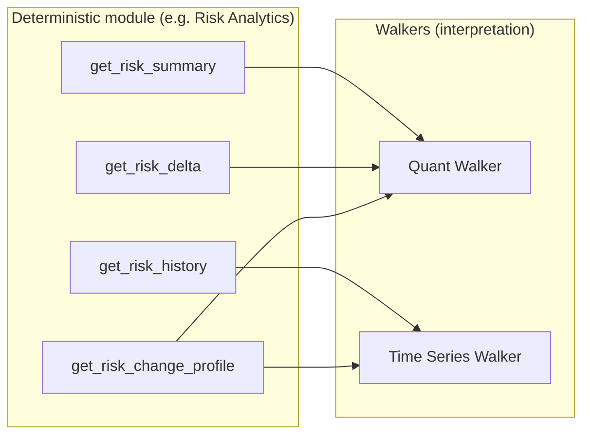

# Run the bank

**Definition:** software that runs in production (or replay) to answer risk questions with **deterministic**, **typed**, **replayable** results — plus **specialist walkers** that synthesize interpretation from those facts.

This is separate from the **meta-process** that builds and governs the repo (next deck).

---

## Capability modules (deterministic core)

Each module owns **deterministic truth** for a bounded domain (`src/modules/README.md`).

**Implemented / in progress (examples):**

| Module | Path | Notes |
| --- | --- | --- |
| Risk Analytics | `src/modules/risk_analytics/` | Contracts, fixture-backed service, business-day resolution |
| Controls Integrity | `src/modules/controls_integrity/` | Typed contracts for integrity domain |

**Roadmap (named in module README / registry):** FRTB PLA controls, limits & approvals, production integrity, governance reporting, capital & desk status, model inventory / usage registry.

---

## Specialist walkers (interpretation, not calculation)

Walkers are **not** generic assistants. Each has a **charter**, **tool permissions**, and **must-not** rules (`docs/05_walker_charters.md`).

| Walker | Role (summary) |
| --- | --- |
| **Quant** | Structural drivers: what moved, where in hierarchy, first- vs second-order |
| **Time series** | Persistence, outliers, regimes, volatility context |
| **Data controller** | Trust, completeness, false-signal conditions |
| **Controls / change** | Releases, model/config changes vs market story |
| **Market context** | External market plausibility |
| **Governance / reporting** | Management-ready narrative blocks |
| **Critic / challenge** | Adversarial pass before handoff |
| **Presentation / viz** | Layout and human-readable form |
| **Model risk & usage** | Intended use, limits, open issues |

**Registry status:** many walkers are **proposed** / draft contract — the *architecture* is explicit; implementation follows PRDs.

---

## Quant vs time series vs deterministic VaR (concrete split)

- **Deterministic layer:** returns governed numbers, statuses, rolling stats, volatility-aware flags — **no LLM**.  
- **Quant Walker:** explains *quantitative* change using summaries, deltas, hierarchy, change profiles.  
- **Time Series Walker:** judges *historical* normality, trends, regime — uses history series and related signals.

---

## Risk Analytics service surface (code fact)

`src/modules/risk_analytics/service.py` exposes:

- `get_risk_summary` — point-in-time measure for a typed `node_ref`  
- `get_risk_delta` — move vs comparison date (default: prior business day)  
- `get_risk_history` — series over a date range  
- `get_risk_change_profile` — first-order move vs second-order instability framing  

Supporting pieces: **contracts** (`contracts/`), **fixtures** (`fixtures/`), **business day resolver** (`time/`).

---

## Walker output shape (contractual discipline)

Walkers are expected to produce structured results including: scope, question, findings, **evidence references**, **caveats**, trust state, confidence, next steps, escalation (`docs/05_walker_charters.md`).

**Hard boundaries:** no inventing facts, no silent override of deterministic results, no governance sign-off.

---

## Orchestrators (preview)

**Process orchestrators** run workflows: daily investigation, limit breach, PLA deterioration, month-end, desk status, model impact, governance pack (`docs/00_tom_overview.md`).

They **route** work and **apply gates**; they do not replace module math or walker remits.
