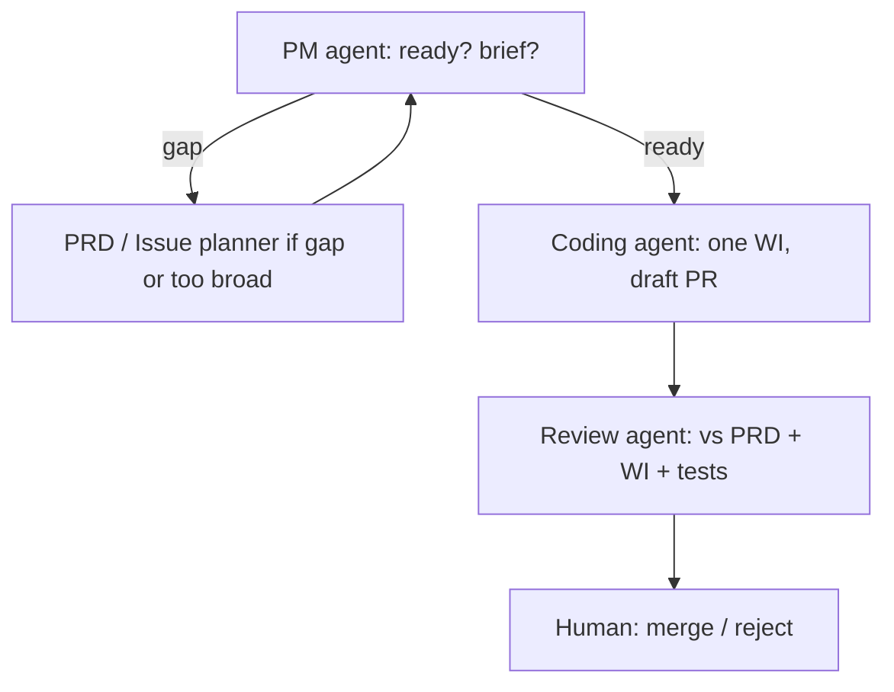

# Change the bank

**Definition:** how the **repository** evolves — specifications, slicing, implementation, review, merge, and periodic **drift** audits. This is **engineering governance**, not production VaR calculation.

---

## Why a multi-agent relay exists

A single session that specs, codes, reviews, and “approves” its own work **collapses governance** (`docs/guides/agent_framework.md`).

**Enforced separation:**

| Role | Owns | Must not |
| --- | --- | --- |
| **PM / coordination** | Sequencing, readiness, briefs | Rewriting architecture ad hoc |
| **PRD / spec author** | Typed contracts, degraded states, methodology precision | Pushing ambiguity to coding |
| **Issue planner** | Small work items from large PRDs | — |
| **Coding** | One bounded slice, tests, draft PR | Inventing contracts / ADR decisions |
| **Review** | Fidelity to PRD/WI, tests, bot triage | Rewriting implementation freely |
| **Human** | Merge, policy, accountability | — |
| **Drift monitor** (separate cadence) | Repo-wide coherence audit | Replacing PR review |

---

## Delivery relay (per work item)



**Drift monitor** runs **outside** this loop and feeds **PM or human** triage (`docs/guides/overnight_agent_runbook.md`).

---

## Artifacts: PRDs → work items → code

```text
docs/prds/          Implementation contracts (e.g. PRD-1.1 Risk Summary Service)
work_items/         Bounded slices, acceptance criteria, links to PRD/ADR
prompts/agents/     Canonical behavior + invocation templates
src/, tests/        Implementation and verification
```

**PM** selects a ready item and produces a **bounded coding brief**. **Coding** implements **exactly that slice** and opens a **draft PR**. **Review** checks against the **linked WI + PRD** (and ADRs). **Human** merges.

---

## Manual operation

1. `git fetch` / fast-forward `main` (freshness rule).  
2. Open **separate** tool sessions for PM → coding → review (`docs/guides/overnight_agent_runbook.md`).  
3. Fill invocation templates from `prompts/agents/invocation_templates/`.  
4. Wait for CI / Copilot / Gemini comments; **review agent** triages them.

---

## Semi-automatic & autonomous operation

**`agent_runtime/`** provides orchestration code: runner dispatch (PM, spec, coding, review, drift-related tooling), state transitions, worktrees, telemetry, optional notifications (`agent_runtime/orchestrator/graph.py`, runners under `agent_runtime/runners/`).

- **Backends** can target **OpenAI**, **Anthropic**, or other configured paths — **API keys** enable LLM-backed steps where wired.  
- **Autonomous loops** are **tested and constrained** in-repo (e.g. supervisor / simulation patterns); **human merge authority** remains the governance default in runbook guidance until policy says otherwise.

**Practical modes:**

| Mode | What runs | Governance |
| --- | --- | --- |
| Manual | Human copies prompts into separate chats | Strongest separation |
| Semi-auto | Runtime invokes runners; human gates merges | Default posture in docs |
| Autonomous | Continuous dispatch with keys & hooks | Requires explicit ops discipline |

---

## Freshness and branching (non-negotiable)

Before PM / coding / review / drift work: **update `main`**. Each implementation slice: **fresh branch from current `main`** (`AGENTS.md`, `CLAUDE.md`).

---

## Skills and operator helpers

`.cursor/skills/` includes e.g. **deliver-wi**, **repo-status**, **run-drift**, **new-prd** — these **generate prompts** for the right role; they do not replace the relay.
