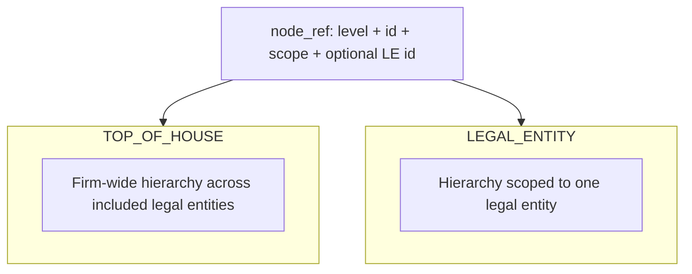

# Risk Analytics & PRD-1.1 (deep dive)

**PRD:** `docs/prds/phase-1/PRD-1.1-risk-summary-service-v2.md`  
**Module:** Risk Analytics — **deterministic service** (explicitly **no LLM**, **no narrative generation** in scope).

---

## Purpose (why one service)

Many processes need the **same** governed answers:

- Current **VaR** / **ES** for a node  
- **What changed** vs comparison date  
- **Recent history**  
- **Complete vs partial vs degraded**  
- **First-order move** vs **second-order volatility** instability  

**One canonical service** replaces inconsistent ad-hoc copies of logic.

---

## In scope vs out of scope (PRD-1.1)

### In scope

- Typed **node reference** + **hierarchy scope** (`TOP_OF_HOUSE` / `LEGAL_ENTITY`)  
- Measures: `VAR_1D_99`, `VAR_10D_99`, `ES_97_5`  
- Summary, delta, history, volatility-aware change signals, snapshot pinning, **business-day** rules via resolver  
- **Fixture-driven** deterministic tests / replay  

### Out of scope (examples)

- Risk-factor decomposition, contributor ranking, Greeks explain, PnL vectors  
- Limit checks, FRTB PLA / HPL / RTPL  
- **Narrative generation**, **agent reasoning**, UI rendering, approvals orchestration  
- FX conversion (v1)

---

## Hierarchy scope (conceptual)



Same logical desk name can mean **different** scope contexts — the service must not conflate them.

---

## API surface ↔ implementation

| PRD operation | Role |
| --- | --- |
| `get_risk_summary` | Point-in-time summary + optional rolling context |
| `get_risk_delta` | Absolute / % delta vs compare date |
| `get_risk_history` | Time series over `[start_date, end_date]` |
| `get_risk_change_profile` | First-order vs second-order framing |

Implemented in `src/modules/risk_analytics/service.py` with **typed contracts** under `src/modules/risk_analytics/contracts/`.

---

## Primary consumers (from PRD)

**Primary:** Quant Walker, Time Series Walker, Governance/Reporting Walker, Capital & Desk Status module, Daily Risk Investigation orchestrator.

**Secondary:** Analyst UI, dashboards, replay harness, tests.

This is the **intended wiring**: modules feed **multiple** interpreters and workflows without forking the math.

---

## Example scenario (end-to-end story)

**Question:** “Desk X VaR is up 12% vs yesterday — is that unusual?”

1. **Deterministic:** `get_risk_delta` / `get_risk_change_profile` returns governed deltas, rolling stats, volatility flags, and explicit **status** if data is partial.  
2. **Data controller walker (when live):** trust / completeness caveats.  
3. **Quant walker:** where the move sits in hierarchy; first- vs second-order reading.  
4. **Time series walker:** historical percentile / regime language using `get_risk_history`.  
5. **Orchestrator:** packages investigation steps; **human** remains accountable for conclusions and action.

---

## Key documents (further reading)

| Document | Content |
| --- | --- |
| `docs/00_tom_overview.md` | TOM modules, walkers, orchestrators |
| `docs/01_mission_and_design_principles.md` | Evidence-first, deterministic core |
| `docs/05_walker_charters.md` | Walker missions and boundaries |
| `docs/guides/agent_framework.md` | Six roles, relay, tool-agnostic use |
| `docs/guides/overnight_agent_runbook.md` | Nightly loop, freshness, sessions |
| `AGENTS.md` | Repo layout, role separation, rules |

---

## Export slides

Chapter files `01`–`04` are merged into one Marp file for export:

```bash
cd presentation && ./build-deck.sh
npx @marp-team/marp-cli@4 --no-stdin deck.md -o risk-manager-overview.pdf
# or: ... -o risk-manager-overview.html
```

---

<!-- _class: lead -->
## Thank you

**Risk Manager** — deterministic core, bounded walkers, governed change.
