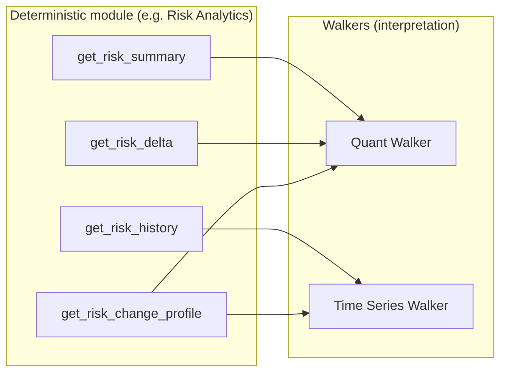
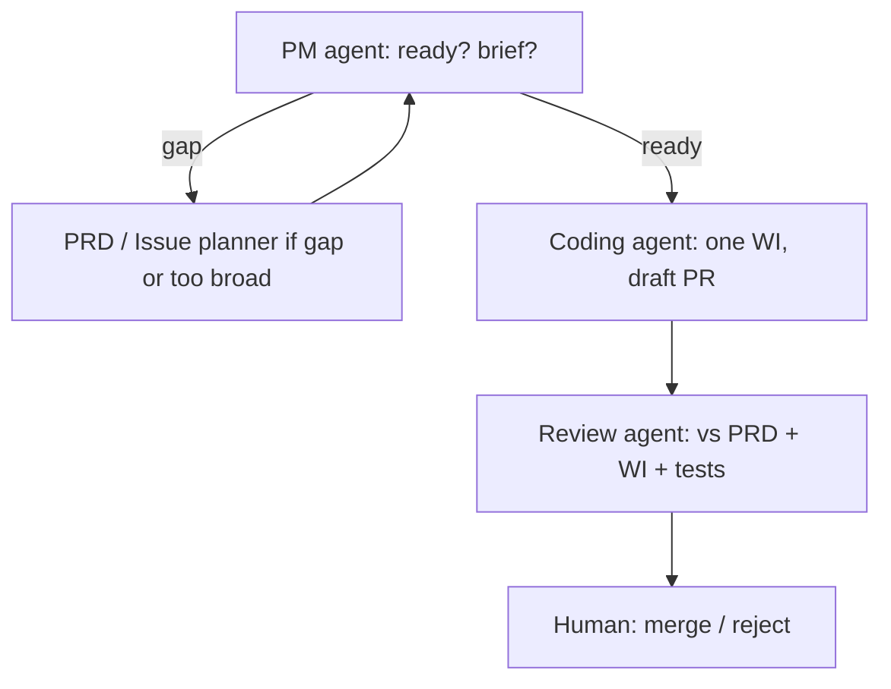
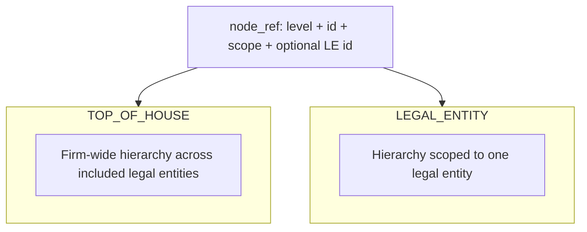

<!-- _class: lead -->
# Risk Manager
## AI-enabled market risk operating model

**Repository:** governed architecture for daily risk work *and* for how the repository itself is built.

---

## Objective (what the platform is for)

From the target operating model (`docs/00_tom_overview.md`):

- **Daily risk investigation** — explain moves with evidence, not narrative alone  
- **FRTB / PLA oversight** — structured controls lens (module roadmap)  
- **Limits and approvals** — policy and workflow (orchestrated, not ad-hoc chat)  
- **Controls & production integrity** — trust and lineage  
- **Desk status / capital consequence** — management-facing views  
- **Governance reporting** — repeatable packs  
- **Controlled change assessment** — change vs market attribution

**Non-goals:** autonomous sign-off, unconstrained “chatbot risk,” or a single monolithic agent owning everything.

---

## Design principle: three layers

```text
┌─────────────────────────────────────────────────────────┐
│  Process orchestrators   workflows, gates, handoffs     │
├─────────────────────────────────────────────────────────┤
│  Specialist walkers      bounded interpretation         │
├─────────────────────────────────────────────────────────┤
│  Capability modules      deterministic truth & rules    │
└─────────────────────────────────────────────────────────┘
```

- **Modules** own canonical calculations, typed state, degraded semantics, replay.  
- **Walkers** consume *typed* module outputs; they interpret, they do not replace truth.  
- **Orchestrators** own routing, challenge, and human decision points.

---

## Run the bank vs change the bank

| | **Run the bank** | **Change the bank** |
| --- | --- | --- |
| **Question** | What is risk? What moved? Is it unusual? | What do we ship next? Is the PR contract-faithful? |
| **Mechanism** | `src/modules/`, walkers, orchestrators | PRDs, `work_items/`, agent relay, `agent_runtime/` |
| **Authoritative outputs** | Typed summaries, history, statuses, replay | Merged code, tests, governed docs |
| **Where AI fits** | Specialist walkers (bounded interpretation) | PM / spec / coding / review / drift roles (governed relay) |

---

## What you will see in this deck

1. **Run the bank** — production capability: modules, deterministic APIs, walkers (risk interpretation).  
2. **Change the bank** — engineering governance: PRDs, work items, multi-agent relay, `agent_runtime`.  
3. **Worked example** — **Risk Analytics** and **PRD-1.1** (risk summary service): contracts, service surface, walker consumers.

*Terminology:* this repository standardizes on **PRD** (product/requirements documents) and governed **specs**; “BRD”-style business intent flows into PRDs and canon under `docs/`.

---

## Repository map (high level)

| Area | Role |
| --- | --- |
| `docs/` | Architecture canon, PRDs, methodology, engineering standards |
| `src/modules/` | Deterministic domain modules (e.g. `risk_analytics`, `controls_integrity`) |
| `prompts/agents/` | Standing instructions + invocation templates per agent role |
| `work_items/` | Bounded implementation slices with acceptance criteria |
| `agent_runtime/` | Optional automation: runners, orchestration graph, telemetry |
| `tests/`, `fixtures/` | Correctness and replay |

---

# Run the bank

**Definition:** software that runs in production (or replay) to answer risk questions with **deterministic**, **typed**, **replayable** results — plus **specialist walkers** that synthesize interpretation from those facts.

This is separate from the **meta-process** that builds and governs the repo (next deck).

---

## Capability modules (deterministic core)

Each module owns **deterministic truth** for a bounded domain (`src/modules/README.md`).

**Implemented / in progress (examples):**

| Module | Path | Notes |
| --- | --- | --- |
| Risk Analytics | `src/modules/risk_analytics/` | Contracts, fixture-backed service, business-day resolution |
| Controls Integrity | `src/modules/controls_integrity/` | Typed contracts for integrity domain |

**Roadmap (named in module README / registry):** FRTB PLA controls, limits & approvals, production integrity, governance reporting, capital & desk status, model inventory / usage registry.

---

## Specialist walkers (interpretation, not calculation)

Walkers are **not** generic assistants. Each has a **charter**, **tool permissions**, and **must-not** rules (`docs/05_walker_charters.md`).

| Walker | Role (summary) |
| --- | --- |
| **Quant** | Structural drivers: what moved, where in hierarchy, first- vs second-order |
| **Time series** | Persistence, outliers, regimes, volatility context |
| **Data controller** | Trust, completeness, false-signal conditions |
| **Controls / change** | Releases, model/config changes vs market story |
| **Market context** | External market plausibility |
| **Governance / reporting** | Management-ready narrative blocks |
| **Critic / challenge** | Adversarial pass before handoff |
| **Presentation / viz** | Layout and human-readable form |
| **Model risk & usage** | Intended use, limits, open issues |

**Registry status:** many walkers are **proposed** / draft contract — the *architecture* is explicit; implementation follows PRDs.

---

## Quant vs time series vs deterministic VaR (concrete split)



- **Deterministic layer:** returns governed numbers, statuses, rolling stats, volatility-aware flags — **no LLM**.  
- **Quant Walker:** explains *quantitative* change using summaries, deltas, hierarchy, change profiles.  
- **Time Series Walker:** judges *historical* normality, trends, regime — uses history series and related signals.

---

## Risk Analytics service surface (code fact)

`src/modules/risk_analytics/service.py` exposes:

- `get_risk_summary` — point-in-time measure for a typed `node_ref`  
- `get_risk_delta` — move vs comparison date (default: prior business day)  
- `get_risk_history` — series over a date range  
- `get_risk_change_profile` — first-order move vs second-order instability framing  

Supporting pieces: **contracts** (`contracts/`), **fixtures** (`fixtures/`), **business day resolver** (`time/`).

---

## Walker output shape (contractual discipline)

Walkers are expected to produce structured results including: scope, question, findings, **evidence references**, **caveats**, trust state, confidence, next steps, escalation (`docs/05_walker_charters.md`).

**Hard boundaries:** no inventing facts, no silent override of deterministic results, no governance sign-off.

---

## Orchestrators (preview)

**Process orchestrators** run workflows: daily investigation, limit breach, PLA deterioration, month-end, desk status, model impact, governance pack (`docs/00_tom_overview.md`).

They **route** work and **apply gates**; they do not replace module math or walker remits.

---

# Change the bank

**Definition:** how the **repository** evolves — specifications, slicing, implementation, review, merge, and periodic **drift** audits. This is **engineering governance**, not production VaR calculation.

---

## Why a multi-agent relay exists

A single session that specs, codes, reviews, and “approves” its own work **collapses governance** (`docs/guides/agent_framework.md`).

**Enforced separation:**

| Role | Owns | Must not |
| --- | --- | --- |
| **PM / coordination** | Sequencing, readiness, briefs | Rewriting architecture ad hoc |
| **PRD / spec author** | Typed contracts, degraded states, methodology precision | Pushing ambiguity to coding |
| **Issue planner** | Small work items from large PRDs | — |
| **Coding** | One bounded slice, tests, draft PR | Inventing contracts / ADR decisions |
| **Review** | Fidelity to PRD/WI, tests, bot triage | Rewriting implementation freely |
| **Human** | Merge, policy, accountability | — |
| **Drift monitor** (separate cadence) | Repo-wide coherence audit | Replacing PR review |

---

## Delivery relay (per work item)



**Drift monitor** runs **outside** this loop and feeds **PM or human** triage (`docs/guides/overnight_agent_runbook.md`).

---

## Artifacts: PRDs → work items → code

```text
docs/prds/          Implementation contracts (e.g. PRD-1.1 Risk Summary Service)
work_items/         Bounded slices, acceptance criteria, links to PRD/ADR
prompts/agents/     Canonical behavior + invocation templates
src/, tests/        Implementation and verification
```

**PM** selects a ready item and produces a **bounded coding brief**. **Coding** implements **exactly that slice** and opens a **draft PR**. **Review** checks against the **linked WI + PRD** (and ADRs). **Human** merges.

---

## Manual operation

1. `git fetch` / fast-forward `main` (freshness rule).  
2. Open **separate** tool sessions for PM → coding → review (`overnight_agent_runbook.md`).  
3. Fill invocation templates from `prompts/agents/invocation_templates/`.  
4. Wait for CI / Copilot / Gemini comments; **review agent** triages them.

---

## Semi-automatic & autonomous operation

**`agent_runtime/`** provides orchestration code: runner dispatch (PM, spec, coding, review, drift-related tooling), state transitions, worktrees, telemetry, optional notifications (`agent_runtime/orchestrator/graph.py`, runners under `agent_runtime/runners/`).

- **Backends** can target **OpenAI**, **Anthropic**, or other configured paths — **API keys** enable LLM-backed steps where wired.  
- **Autonomous loops** are **tested and constrained** in-repo (e.g. supervisor / simulation patterns); **human merge authority** remains the governance default in runbook guidance until policy says otherwise.

**Practical modes:**

| Mode | What runs | Governance |
| --- | --- | --- |
| Manual | Human copies prompts into separate chats | Strongest separation |
| Semi-auto | Runtime invokes runners; human gates merges | Default posture in docs |
| Autonomous | Continuous dispatch with keys & hooks | Requires explicit ops discipline |

---

## Freshness and branching (non-negotiable)

Before PM / coding / review / drift work: **update `main`**. Each implementation slice: **fresh branch from current `main`** (`AGENTS.md`, `CLAUDE.md`).

---

## Skills and operator helpers

`.cursor/skills/` includes e.g. **deliver-wi**, **repo-status**, **run-drift**, **new-prd** — these **generate prompts** for the right role; they do not replace the relay.

---

# Risk Analytics & PRD-1.1 (deep dive)

**PRD:** `docs/prds/phase-1/PRD-1.1-risk-summary-service-v2.md`  
**Module:** Risk Analytics — **deterministic service** (explicitly **no LLM**, **no narrative generation** in scope).

---

## Purpose (why one service)

Many processes need the **same** governed answers:

- Current **VaR** / **ES** for a node  
- **What changed** vs comparison date  
- **Recent history**  
- **Complete vs partial vs degraded**  
- **First-order move** vs **second-order volatility** instability  

**One canonical service** replaces inconsistent ad-hoc copies of logic.

---

## In scope vs out of scope (PRD-1.1)

### In scope

- Typed **node reference** + **hierarchy scope** (`TOP_OF_HOUSE` / `LEGAL_ENTITY`)  
- Measures: `VAR_1D_99`, `VAR_10D_99`, `ES_97_5`  
- Summary, delta, history, volatility-aware change signals, snapshot pinning, **business-day** rules via resolver  
- **Fixture-driven** deterministic tests / replay  

### Out of scope (examples)

- Risk-factor decomposition, contributor ranking, Greeks explain, PnL vectors  
- Limit checks, FRTB PLA / HPL / RTPL  
- **Narrative generation**, **agent reasoning**, UI rendering, approvals orchestration  
- FX conversion (v1)

---

## Hierarchy scope (conceptual)



Same logical desk name can mean **different** scope contexts — the service must not conflate them.

---

## API surface ↔ implementation

| PRD operation | Role |
| --- | --- |
| `get_risk_summary` | Point-in-time summary + optional rolling context |
| `get_risk_delta` | Absolute / % delta vs compare date |
| `get_risk_history` | Time series over `[start_date, end_date]` |
| `get_risk_change_profile` | First-order vs second-order framing |

Implemented in `src/modules/risk_analytics/service.py` with **typed contracts** under `src/modules/risk_analytics/contracts/`.

---

## Primary consumers (from PRD)

**Primary:** Quant Walker, Time Series Walker, Governance/Reporting Walker, Capital & Desk Status module, Daily Risk Investigation orchestrator.

**Secondary:** Analyst UI, dashboards, replay harness, tests.

This is the **intended wiring**: modules feed **multiple** interpreters and workflows without forking the math.

---

## Example scenario (end-to-end story)

**Question:** “Desk X VaR is up 12% vs yesterday — is that unusual?”

1. **Deterministic:** `get_risk_delta` / `get_risk_change_profile` returns governed deltas, rolling stats, volatility flags, and explicit **status** if data is partial.  
2. **Data controller walker (when live):** trust / completeness caveats.  
3. **Quant walker:** where the move sits in hierarchy; first- vs second-order reading.  
4. **Time series walker:** historical percentile / regime language using `get_risk_history`.  
5. **Orchestrator:** packages investigation steps; **human** remains accountable for conclusions and action.

---

## Key documents (further reading)

| Document | Content |
| --- | --- |
| `docs/00_tom_overview.md` | TOM modules, walkers, orchestrators |
| `docs/01_mission_and_design_principles.md` | Evidence-first, deterministic core |
| `docs/05_walker_charters.md` | Walker missions and boundaries |
| `docs/guides/agent_framework.md` | Six roles, relay, tool-agnostic use |
| `docs/guides/overnight_agent_runbook.md` | Nightly loop, freshness, sessions |
| `AGENTS.md` | Repo layout, role separation, rules |

---

## Export slides

Chapter files `01`–`04` are merged into one Marp file for export:

```bash
cd presentation && ./build-deck.sh
npx @marp-team/marp-cli@4 --no-stdin deck.md -o risk-manager-overview.pdf
# or: ... -o risk-manager-overview.html
```

---

<!-- _class: lead -->
## Thank you

**Risk Manager** — deterministic core, bounded walkers, governed change.
